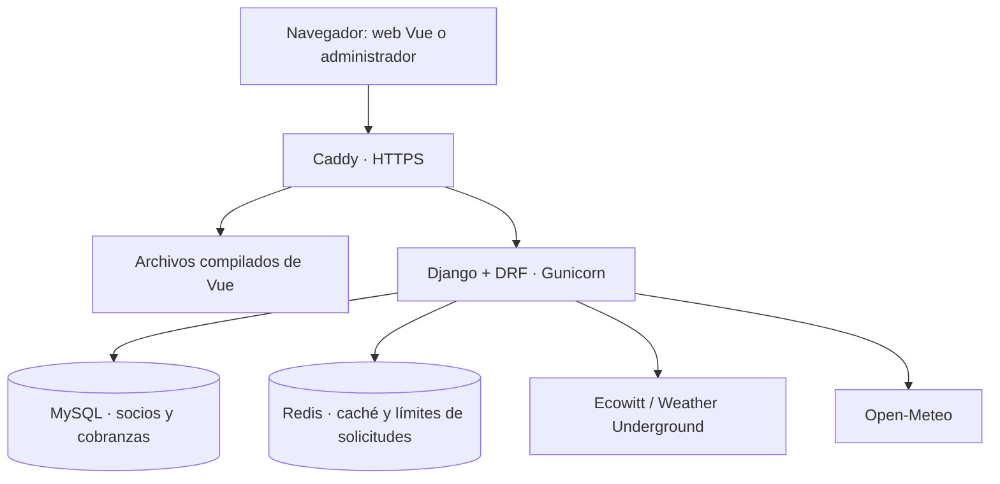

# Arquitectura

[Índice](README.md) · [API](API.md) · [Despliegue](DEPLOYMENT.md)

## Vista general

La aplicación combina un backend Django organizado por dominios, una web pública
Vue y el administrador de Django para el personal del club. En producción, Caddy
sirve la web compilada y deriva las rutas del backend a Gunicorn bajo el mismo origen.

Solo el gateway publica puertos en producción. MySQL y Redis están en una red
interna; el backend dispone además de salida para consultar las fuentes externas.
En desarrollo, Vite cumple la función de proxy para las rutas del backend.

## Módulos y responsabilidades

| Módulo | Responsabilidad | Referencia |
| --- | --- | --- |
| `usuarios` | Personas, socios, solicitudes, estados y habilitación | [Servicios de socios](../amandaye_backend/apps/usuarios/services/socios.py) |
| `cobranzas` | Cuentas, conceptos, cargos, pagos, aplicaciones, cuotas y auditoría | [Servicios de cobranzas](../amandaye_backend/apps/cobranzas/services/) |
| `conditions` | Adquisición, normalización y consolidación meteorológica | [Guía del módulo](CONDITIONS.md) |
| `security` | Autenticación, configuración segura y tratamiento de errores | [Controles del backend](../amandaye_backend/amandaye_backend/security/) |
| Frontend | Portada, inscripción, navegación y visualización ambiental | [Código Vue](../amandaye_frontend/src/) |

Las rutas activas se definen en [Django](../amandaye_backend/amandaye_backend/urls.py)
y en [Vue Router](../amandaye_frontend/src/router/index.ts). La presencia de una
carpeta en `apps/` no implica por sí sola que el módulo esté publicado o completo.

## Flujos principales

### Inscripción y gestión de socios

1. El formulario público envía una solicitud validada al backend.
2. El servicio crea la solicitud pendiente. La respuesta pública confirma su
   recepción sin devolver el registro personal ni revelar si ya existía.
3. Un operador autorizado revisa la solicitud. Las transiciones de estado verifican
   permisos en el backend y coordinan los cambios asociados de cuenta y cargos.

La administración usa sesiones Django y CSRF. La API privada usa JWT; la sesión
del administrador no reemplaza el token de una llamada a la API.

### Cobranzas

Una **cuenta corriente** agrupa cargos y pagos. Una **aplicación de pago** asigna
parte de un pago a un cargo. Esa separación permite conservar cuánto se adeuda y
cuánto queda disponible para aplicar.

Los servicios realizan las escrituras dentro de transacciones y usan bloqueos de
filas para coordinar operaciones concurrentes. Las correcciones de movimientos
existentes se realizan mediante anulaciones y reversiones auditadas. La API no
ofrece edición ni eliminación genérica de cargos, pagos o aplicaciones.

Las pruebas con SQLite verifican reglas y permisos. Las garantías de concurrencia
dependen de MySQL/InnoDB y se comprueban en el
[entorno de pruebas desechable](DEVELOPMENT.md#concurrencia-con-mysql).

### Información meteorológica

El navegador consulta únicamente la API del club. Django obtiene los datos de las
estaciones y del proveedor de pronóstico, normaliza unidades, conserva cachés por
fuente y calcula la respuesta consolidada.

Las observaciones y el pronóstico tienen fechas y disponibilidad independientes.
Una fuente caída no impide responder con las otras. Los datos anteriores se marcan
con su antigüedad; un valor ausente permanece `null`. Los fallos y los periodos de
actualización también se cachean para moderar las consultas externas.

Redis se utiliza en ambos entornos Compose. Sin `REDIS_URL`, el desarrollo nativo
puede usar caché local a un proceso; las pruebas SQLite usan esa caché local.
El módulo ambiental no tiene modelos ni almacena series históricas en MySQL.

## Configuración y datos

| Elemento | Fuente de configuración |
| --- | --- |
| Servicios, redes y volúmenes | Archivos `docker-compose*.yml` de cada entorno |
| Django, seguridad y base de datos | [settings.py](../amandaye_backend/amandaye_backend/settings.py) |
| Secretos de aplicación e infraestructura | Archivos locales preparados por [bootstrap_secrets.py](../scripts/bootstrap_secrets.py) |
| Estaciones, coordenadas, umbrales y caché | [conditions/config.py](../amandaye_backend/apps/conditions/config.py) |
| Dependencias | `requirements.in` y `requirements.txt`; `package.json` y `package-lock.json` |

Los contenedores omiten la carga automática del `.env` del backend. Reciben sus
variables y archivos de secretos mediante Compose. Las migraciones se ejecutan
explícitamente; el arranque del servicio no migra la base.

## Alcance actual

- La administración interna se concentra en Django Admin y la API; las rutas Vue
  publicadas son `/` y `/condiciones-del-rio`.
- El scraping de estaciones es provisional y depende del formato de sus páginas
  públicas. Las API oficiales requieren credenciales propias.
- Altura del río, corrientes y evaluación de navegación son extensiones pendientes.
- El frontend enlaza un manifiesto web, pero no incluye service worker ni
  persistencia de datos para uso sin conexión entre reinicios.

Las decisiones específicas de unidades, consolidación, concurrencia de consultas
y manejo de errores están en [Condiciones del río](CONDITIONS.md).
