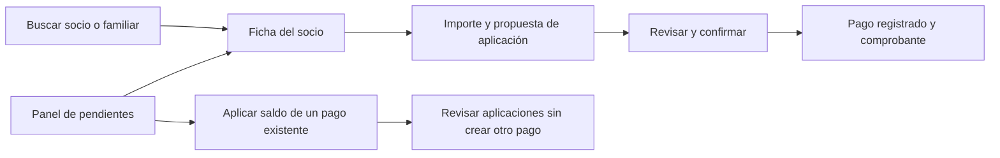
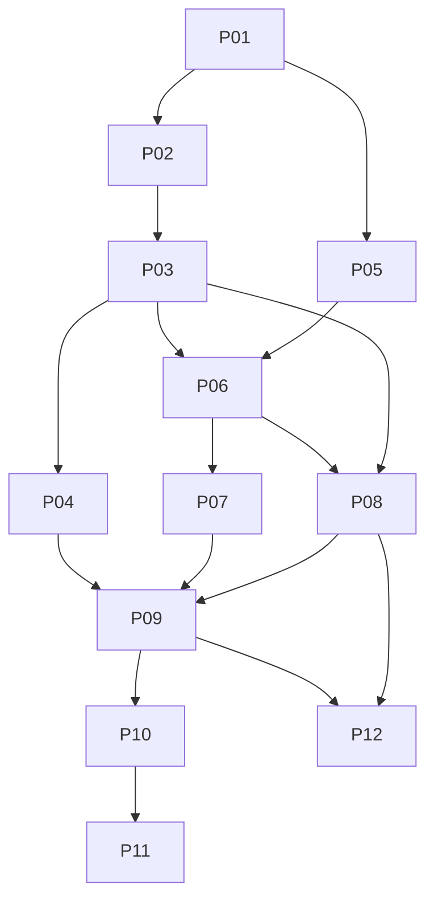

# Plan de gestión para Secretaría y Tesorería

[Documentación](../docs/README.md) · [Continuidad](../docs/CONTINUITY.md) · [Arquitectura](../docs/ARCHITECTURE.md)

**Estado:** propuesta de implementación, revisada el 1 de octubre de 2026. El encargo actual
es planificar. Ninguna funcionalidad de este documento está implementada por esta entrega.
Base revisada: `22d4148`, rama `codex/condiciones-rio-scraping`.

## 1. Objetivo y primera entrega

Reducir los pasos diarios para encontrar a una familia, entender su situación,
cobrar y resolver pendientes, conservando las reglas y la auditoría existentes.

La primera entrega funcional reúne **ficha unificada + cobro simplificado + panel
de pendientes**, con comprobante interno PDF. Se construye en incrementos pequeños:
la ficha de consulta puede probarse antes de habilitar escrituras financieras.

| Hito de producto | Incrementos | Resultado para el equipo |
| --- | --- | --- |
| Consulta unificada | P01–P04 | Buscar y atender desde la ficha; historial atribuible. |
| Cobro completo | P05–P07 | Confirmar el pago y sus aplicaciones, obtener comprobante. |
| Primera entrega integrada | P08–P09 | Resolver pendientes y validar los recorridos en un piloto. |
| Evolución de gestión | P10–P12 | Tarifas, cuotas con vista previa y seguimiento de deuda. |

Resultados que se medirán en un piloto con datos sintéticos:

- Encontrar un socio por número, cédula o nombre y abrir su ficha desde una búsqueda.
- Registrar un cobro desde esa ficha, revisar aplicaciones y confirmar una sola vez.
- Descargar el mismo comprobante después de un reintento o de cerrar la pantalla.
- Abrir cada pendiente en su contexto, sin volver a buscar a la persona o al pago.
- Comparar tiempo, pantallas visitadas y errores contra el recorrido actual. Medir
  la base con Secretaría/Tesorería antes de prometer porcentajes de mejora.

## 2. Decisiones propuestas y preguntas pendientes

| Decisión | Propuesta de partida | Estado |
| --- | --- | --- |
| Interfaz interna | Vistas y plantillas propias de Django, con sesión existente y rutas `/admin/gestion/`. | Consultada al usuario; supuesto del borrador hasta respuesta. |
| Aplicación del cobro | Sugerir cargos por vencimiento, emisión e ID; el operador puede ajustar. | Consultada al usuario; supuesto del borrador hasta respuesta. |
| Excedente | Mostrar y confirmar expresamente el saldo que quedará sin aplicar. Permitir pago a cuenta. | Propuesta; validar en P01. |
| Intención del saldo | Distinguir explícitamente anticipo y aplicación pendiente; conservar actor/fecha de clasificación. Los pagos heredados quedan sin clasificar. | Propuesta; acordar en P01. No inferir intención por texto libre. |
| Datos de la ficha | Consultar; editar contacto y resolver acciones mediante pantallas existentes autorizadas durante el piloto. | Propuesta para acotar la primera versión. |
| Comprobante | Documento interno numerado, reimprimible; definir moneda, identificación del club y texto antes de P07. | Datos pendientes. No se contempla integración fiscal en esta etapa. |
| Permisos adicionales | Mantener las capacidades actuales y acordar solo las ampliaciones necesarias. | Matriz a cerrar en P01; no ejecutar `setup_roles` sobre datos reales. |
| Operación | Relevar cantidad aproximada de socios, operadores simultáneos y servidor antes del piloto. | Pendiente; afecta rendimiento y programación de tareas. |
| Fecha operativa | Usar una fecha común del club en `America/Montevideo` para vencimientos, propuesta y recálculo, tras contrastar los usos actuales de `date.today()`. | Propuesta; probar el cambio de día y de periodo sin alterar fechas históricas. |

La opción Django reutiliza autenticación y permisos, y separa los procesos de los
formularios de tablas. La documentación recomienda vistas propias para interfaces
organizadas alrededor de procesos. Es una decisión propuesta para este proyecto:
[Django Admin 5.2](https://docs.djangoproject.com/en/5.2/ref/contrib/admin/).

Si se elige Vue, conservar los servicios y reglas descritos aquí; sustituir P02,
P03, P06 y P08 por pantallas Vue y contratos DRF. Añadir gestión de sesión/tokens,
consulta de permisos efectivos y pruebas de vencimiento de sesión. No usar los
nombres de grupos de `/api/me/` como autorización ni suponer que la sesión del
admin autentica automáticamente la API JWT.

## 3. Qué existe y qué falta

| Evidencia revisada | Consecuencia para el plan |
| --- | --- |
| [Modelos de usuarios](../amandaye_backend/apps/usuarios/models.py): `Socios`, `Personas`, embarcaciones, aprobaciones y avales. | La ficha puede agrupar datos existentes. `numeroSocio`, `id_socio` y `cedulaTitular` todavía son valores sin FK. |
| [Cuentas](../amandaye_backend/apps/cobranzas/services/cuentas.py) y [pagos](../amandaye_backend/apps/cobranzas/services/pagos.py). | Reutilizar servicios; falta una operación de cobro completo con protección contra reintentos. Las cuentas cerradas aceptan liquidación de deuda histórica. |
| [Modelos financieros](../amandaye_backend/apps/cobranzas/models.py). | Deuda pendiente y saldo de pagos sin aplicar son conceptos distintos. No compensarlos automáticamente en la ficha. |
| `Socios_cambios` no tiene relación explícita al socio; los servicios guardan referencias en texto. | No reconstruir un historial individual buscando números en comentarios. P04 agrega eventos vinculados; el pasado incompleto se identifica como tal. |
| [Admin de usuarios](../amandaye_backend/apps/usuarios/admin.py) registra cambios de campos en `LogEntry`. | Puede aportar eventos identificables; filtrar los campos mostrados para no revelar información sensible. No representa todas las operaciones fuera del admin. |
| [Roles](../amandaye_backend/apps/usuarios/management/commands/setup_roles.py). | Secretaría cobra, pero no aprueba socios ni tiene permiso de resumen global; tampoco hay asignaciones generales de embarcaciones, aprobaciones y avales para ambos equipos. |
| [Cuotas](../amandaye_backend/apps/cobranzas/services/cuotas.py). | Hay generación por cuenta, beca del 50 %, exoneración y reglas de matrícula; no hay simulación pura, tarifas por vigencia ni lote auditable. |
| [Habilitación](../amandaye_backend/apps/usuarios/services/habilitacion.py) y [comando de recálculo](../amandaye_backend/apps/usuarios/management/commands/recalcular_habilitados.py). | El comando existe. El evaluador devuelve un estado; hace falta compartir motivos y garantizar que una tarea periódica no persista resultados obsoletos. La fecha actual se actualiza solo ante cambio o primer cálculo en el recálculo masivo. |
| [Router Vue](../amandaye_frontend/src/router/index.ts). | Hoy solo publica portada y condiciones del río. No hay panel interno Vue terminado que reutilizar. |
| [Gateway](../docker/gateway/Caddyfile) y [proxy Vite](../amandaye_frontend/vite.config.js). | Ambos derivan `/admin/` al backend. La propuesta evita crear un prefijo que termine por error en la aplicación pública. |

Esta revisión fue del código, no de la base real. No se conoce aún cuántos vínculos
inconsistentes existen. No se consultaron registros personales para preparar el plan.

## 4. Pantallas y recorridos



### Ficha unificada

- Cabecera: número, titular, tipo, estado y acciones permitidas.
- Familia y contacto: relación con titular y datos necesarios para atención.
- Cuenta: deuda total, deuda vencida y saldo sin aplicar, cada uno por separado;
  cargos y pagos paginados, con acceso a aplicaciones y reversiones.
- Habilitaciones: inicialmente estado y fecha registrada; P08 incorpora motivos,
  fecha efectiva de evaluación y próxima acción posible usando un evaluador compartido.
- Embarcaciones/percha: información existente, solo con permiso; una casilla
  `percha` actual no equivale a un sistema de ocupación o lista de espera.
- Historial: fuente, fecha, actor y acción verificable, con paginación.
- Estados explícitos: solicitud sin cuenta, titular no encontrado, vínculo
  inconsistente, sin movimientos y acceso insuficiente. Abrir la ficha no crea cuenta.
- No mostrar salud, llaves o comentarios libres por defecto. Los controles de
  permisos se aplican antes de cargar o serializar cada sección.

### Cobro

1. Identificar socio/cuenta y mostrar deuda y créditos existentes.
2. Registrar fecha, medio actual (`EFECTIVO`, `TRANSFERENCIA`, `BROU`, `OTRO`),
   importe y referencia; advertir posibles coincidencias sin declarar duplicado
   un pago legítimo solo porque tenga el mismo importe y fecha.
3. Proponer distribución a cargos con saldo. Orden estable: vencimiento, emisión,
   ID. Mostrar cargos futuros y no marcarlos como vencidos.
4. Permitir modificar la distribución y mostrar el saldo final sin aplicar.
5. Confirmar. El servidor vuelve a comprobar permisos, cuentas, importes y saldos.
   Si cambió la propuesta, mostrarla de nuevo: no modificar silenciosamente la elección.
6. Mostrar pago y aplicaciones guardados y ofrecer comprobante. Un fallo al
   generar/descargar PDF permite reintentar la descarga sin repetir el cobro.

El recorrido para **aplicar un pago existente** empieza con su saldo disponible;
no llama a registrar un pago nuevo. Las correcciones conservan las reversiones
actuales. La reversión de una aplicación no anula el dinero recibido.

### Pendientes

| Cola | Definición inicial | Acción |
| --- | --- | --- |
| Solicitudes | Socios con `activo=2`, ordenados por fecha de solicitud. | Abrir ficha; aprobar/rechazar solo con permiso. |
| Pagos sin aplicar | Importe recibido menos aplicaciones activas mayor que cero. | Aplicar saldo existente; distinguir anticipos intencionales. |
| Deuda vencida | Cargo no anulado, saldo positivo y vencimiento anterior a la fecha operativa. | Ficha y cobro; seguimiento cuando exista P12. |
| Habilitaciones | Evaluación explica requisitos faltantes, suspensión o revocación. | Separar requisitos temporales de aprobaciones/avales que un operador puede resolver. |

Las tarjetas, sus totales, búsquedas, exportaciones y enlaces siguen la misma
autorización. Se requiere decisión explícita para habilitar resúmenes globales a
Secretaría. Se mantiene el acceso a cuentas individuales que ya permite su rol.

## 5. Arquitectura y reglas que deben conservarse

- Propuesta: nueva app pequeña `apps/gestion`, con vistas, formularios, consultas
  y plantillas; registro de sus rutas antes del catch-all del admin. Proteger vistas
  con sesión activa, `is_staff`, permisos efectivos, CSRF y respuestas privadas sin caché.
- Navegación visible desde el admin hacia Gestión, con vuelta a las listas actuales.
  Los enlaces se generan por nombre de ruta. Usar POST para escrituras y redirigir
  al resultado tras éxito. No hacer escrituras desde GET.
- La lógica financiera permanece en `apps/cobranzas/services/`; transiciones en
  `apps/usuarios/services/`. Las consultas agregadas se comparten entre ficha y panel.
- Importes `Decimal`, dos decimales exactos. Excluir aplicaciones revertidas y
  cargos anulados. No introducir un saldo almacenado que compita con el libro actual.
- Pago y todas sus aplicaciones se guardan en una sola transacción; falla cualquier
  aplicación y se revierte la operación completa. Comprobar todos los permisos
  antes de escribir. Mantener compatibilidad de las funciones existentes.
- Mantener Cuenta → Pago → Cargo → Aplicación y orden por PK dentro de cada conjunto;
  Socio precede Cuenta en transiciones y cuotas. No introducir locks en orden inverso
  al extraer helpers o cambiar el recálculo; probar operaciones concurrentes en MySQL.
- Protección persistente contra reintentos: clave única de operación y huella del
  contenido normalizado, asociados al resultado en la misma transacción. Misma clave
  y mismo contenido devuelven el resultado; contenido distinto genera conflicto.
  No usar solo botón deshabilitado, sesión o caché para esta garantía.
- El registro de operación se vincula a actor y cuenta. Reconsultarlo exige permiso
  vigente sobre el resultado; la clave no concede acceso. No guardar cuerpos HTTP
  completos ni secretos. Registrar también la aplicación de un pago ya existente.
- Preparar al confirmar los datos estables del recibo: identidad necesaria, moneda,
  importe, fecha, medio, referencia e identificación única del pago; incluir la
  distribución original con ID de cargo/aplicación, concepto, periodo, importe y
  saldo sin aplicar al cierre. El PDF se genera después del commit; una reimpresión
  no cambia datos originales por cambios de contacto.
- Movimientos posteriores se muestran como tales, con su fecha y auditoría. No
  reescribir la distribución original del comprobante ni mostrarla como estado actual.
- Evitar consultas por cada fila: agregados, carga relacionada y paginación. Los
  filtros aplican antes de paginar. Medir número de consultas con fixtures pequeños y grandes.

## 6. Secuencia de implementación

Cada fila define un incremento revisable. Dividirlo si excede una PR manejable.
Los pasos de código están **pendientes**; P01 comienza cuando se decida implementar.
Las referencias de verificación B, M y V están en la sección 8.

| Paso | Entrega | Depende de | Atención principal |
| --- | --- | --- | --- |
| P01 | Contratos de pantalla, permisos y casos de aceptación | Decisiones de la sección 2 | Dominio y límites de acceso |
| P02 | Base del panel Django y navegación | P01 | Sesiones, CSRF y rutas |
| P03 | Búsqueda y ficha de consulta | P02 | Identidad, saldos y consultas |
| P04 | Historial verificable | P03 | Auditoría y migración aditiva |
| P05 | Servicio de cobro completo y reintentos | P01 | Transacciones y concurrencia |
| P06 | Pantalla de cobro y aplicación de saldo existente | P03, P05 | Errores, reintentos y claridad |
| P07 | Comprobante interno PDF | P06 | Reimpresión y permisos |
| P08 | Panel de pendientes y motivos de habilitación | P03, P06 | Consultas y permisos por cola |
| P09 | Recálculo periódico fiable y piloto de la primera entrega | P04, P07, P08 | Concurrencia y operación |
| P10 | Tarifas por vigencia | Piloto P09 | Historia de precios |
| P11 | Emisión de cuotas con vista previa | P10 | Simulación, confirmación y lotes |
| P12 | Seguimiento de cobranzas | P08, piloto P09 | Contactos y acuerdos |

Aunque la vista previa es la cuarta prioridad de producto, conviene implementar
primero su base de tarifas para evitar rehacer el cálculo. P12 puede adelantarse
a P10/P11 después del piloto si el trabajo de contacto lo justifica.

### P01 — Contratos y casos

**Contexto:** roles y reglas ya existen, pero faltan decisiones de interfaz y
visibilidad. Consultar `setup_roles.py`, modelos y este plan.

**Trabajo:** acordar las decisiones de la sección 2; dibujar las tres pantallas;
fijar campos, acciones, estados vacíos, fecha operativa y matriz de permisos por
sección. Definir moneda/identificación del recibo, intención del saldo sin aplicar
y si Secretaría verá totales globales. Definir quién consulta y quién registra
aprobaciones y avales.

**Salida:** ejemplos sintéticos cubren socios individuales, familiares, pendientes,
bajas con deuda, anticipos y usuarios sin permiso. No se cambia ninguna regla por
deducción de un grupo. **Verificación:** revisión de contratos/documentación.
**Retirada:** revisar el documento; sin datos modificados.

### P02 — Base de Gestión

**Contexto:** el admin usa sesión y `/admin/` ya tiene proxy; Vue sigue como web pública.
**Trabajo:** crear app/plantillas/rutas, navegación, permisos y página inicial;
verificar que `/admin/gestion/` no caiga en el catch-all. Preservar login/logout y
destino de retorno seguro. No añadir una segunda autenticación.
**Salida:** acceso desde admin; anónimo, inactivo, no staff y staff sin permisos
no reciben datos; POST sin CSRF rechazado; navegación usable con teclado y móvil.
**Verificación:** B y V. **Retirada:** ocultar acceso/desactivar rutas; admin sigue operativo.

### P03 — Ficha y búsqueda

**Contexto:** las relaciones heredadas son números; `obtener_estado_cuenta` consulta
movimientos y no descuenta créditos automáticamente. **Trabajo:** consultas de
lectura para titular/familia/cuenta; búsqueda por cédula, número o nombre, con
homónimos; secciones autorizadas, paginación y enlaces a ediciones existentes.
Mostrar datos inconsistentes sin adjudicarlos a otra persona.
**Salida:** totales coinciden con servicios para cargos parciales/anulados y
aplicaciones revertidas; abrir ficha de pendiente no crea cuenta; consultas no crecen
linealmente por movimiento ni usuario listado. **Verificación:** B y V, límites de
consultas con fixtures. **Retirada:** desactivar ficha; sin migración de relaciones.

### P04 — Historial individual

**Contexto:** `Socios_cambios` carece de FK; `LogEntry` cubre cambios del admin.
**Trabajo:** agregar un registro estructurado de evento con socio, actor, momento,
acción y referencia de origen; instrumentar transiciones en su transacción. Integrar
eventos financieros y del admin solo cuando la identidad sea inequívoca. Mantener
registros anteriores; no inferir identidad por texto ni duplicar eventos de una
misma acción. Resolver generación concurrente de IDs en las rutas modificadas.
**Salida:** actor/acción/recurso trazables; rollback no deja evento de éxito; pasado
no atribuible señalado como incompleto. **Verificación:** B, M y migración sobre
fixtures de legado. **Retirada:** quitar lectores/escritores nuevos preservando tabla
y registros; no borrar auditoría al volver a una versión anterior.

### P05 — Cobro transaccional

**Contexto:** `registrar_pago` y `aplicar_pago` son separados y ya autorizan/bloquean.
**Trabajo:** servicio orquestador para pago nuevo y otro para distribuir saldo
existente; validación completa y claves persistentes de operación. Migración aditiva
para operación/resultado y datos originales del comprobante, incluida su distribución.
Registrar la intención explícita del saldo, sin clasificar automáticamente pagos
heredados; conservar auditoría de reclasificaciones. Extraer helpers solo
si permiten preservar reglas/orden de locks; recalcular una vez por operación cuando
sea viable sin cambiar la garantía de consistencia.
**Salida:** mismo reintento devuelve mismo pago; solicitud diferente con misma clave
falla; no sobraplica ni mezcla cuentas; un fallo intermedio no guarda medio cobro;
cuenta cerrada permite liquidar deuda histórica sin reactivarla.
**Verificación:** B y M, incluidos dos operadores, claves simultáneas, propuesta
obsoleta, pago parcial, excedente y revocación de permisos antes de confirmar.
**Retirada:** desactivar nuevas operaciones; conservar pagos, claves y snapshots.

### P06 — Recorrido de cobro

**Contexto:** P05 ofrece operaciones atómicas; P03 aporta contexto de socio/cuenta.
**Trabajo:** formularios de importe/distribución/revisión; clave estable durante
reintentos; recuperar resultado tras respuesta perdida. Acceso separado para aplicar
un pago existente. Cuando quede saldo, registrar si es anticipo o aplicación pendiente.
Conservar entradas ante validación sin convertirlas en datos confiables.
**Salida:** un recorrido completo desde ficha; valores finales y saldo sin aplicar
visibles; doble clic/recarga no duplican; sesión vencida permite volver de forma
segura sin reenviar automáticamente el cobro. **Verificación:** B, M y V.
**Retirada:** ocultar nueva UI, mantener administración existente y datos guardados.

### P07 — Comprobantes

**Contexto:** no hay biblioteca PDF en `requirements.in`; P05 conserva datos originales.
**Trabajo:** elegir y fijar una biblioteca de generación de PDF compatible con la
imagen actual, luego actualizar lock con hashes; numeración única vinculada al pago,
plantilla con moneda explícita y descarga privada. No depender de recursos remotos
para renderizar. Durante la convivencia, los pagos creados por el admin/API antiguos
pueden carecer de snapshot, igual que los históricos. Para cualquier pago sin snapshot,
emitir por POST un comprobante reconstruido, identificado como tal y con fecha de
reconstrucción; conservar sus datos desde esa primera emisión para reimpresiones
estables. GET solo descarga. Nunca presentarlo como original del momento del cobro.
**Salida:** PDF legible con tildes y familia, acceso denegado sin permiso, reimpresión
estable; error PDF no repite pago. Emisión reconstruida concurrente no duplica ni
renumera documentos. **Verificación:** B y M para unicidad de emisión, compatibilidad
con pagos creados por admin/API antiguos, build del backend si cambian
dependencias y revisión visual de PDFs sintéticos. **Retirada:** desactivar descarga
conservando los registros; no borrar ni renumerar recibos.

### P08 — Pendientes

**Contexto:** ver colas exige permisos diferentes; el evaluador de habilitación hoy
devuelve solo estado. **Trabajo:** compartir un evaluador puro de estado y motivos
con ficha/admin/recálculo, conservando precedencia de revocación y suspensión; colas
paginadas y filtros con enlaces a ficha/cobro/acciones ya existentes. No duplicar
la política de habilitación en las plantillas.
**Salida:** cada tarjeta coincide con su lista; ocultar también totales no autorizados;
mostrar intención de anticipo/aplicación pendiente o "sin clasificar" según P05/P06;
no ocultar crédito por falta de clasificación. Razones temporales distintas de
acciones de aprobación.
**Verificación:** B y V; regresión de todas las reglas de habilitación y roles.
**Retirada:** ocultar panel conservando ficha y servicios existentes.

### P09 — Recálculo y piloto

**Contexto:** `recalcular_habilitados` existe, pero una ejecución masiva puede leer
datos que luego cambian. **Trabajo:** recálculo por cuenta/persona con lectura
coherente y locks compatibles. Inventariar y adaptar también `PersonasAdmin`, los
`save()` de aprobaciones/avales y cualquier escritor que hoy guarde Persona antes
de recalcular. Evitar el ciclo Persona→Cuenta frente a Cuenta→Persona: todos los
escritores deben compartir un protocolo antes de activar el scheduler.
Pruebas de cobro simultáneo con edición de persona, aprobación, aval/revocación,
reversión y baja, además de ejecuciones simultáneas del scheduler;
registrar último intento/éxito/cantidades sin datos personales. Programación diaria
en el servidor con zona horaria explícita, exclusión de ejecuciones solapadas,
reintentos acotados y detección de fallos. Elegir scheduler según hosting; no usar
una automatización de Codex ni introducir Celery solo para un comando diario.
**Salida:** cumpleaños, antigüedad y nuevo periodo se reflejan; un cálculo antiguo
no sobrescribe un resultado nuevo; mostrar fecha de evaluación real incluso sin
cambio de estado. Piloto de los tres recorridos con Secretaría/Tesorería.
**Verificación:** B, M y V; escenarios temporales y ejecución fallida/solapada.
**Retirada:** desactivar scheduler y panel nuevo; conservar estado/auditoría,
recálculo manual controlado disponible. No restaurar una copia antigua sobre cobros nuevos.

### P10 — Tarifas por vigencia

**Contexto:** los conceptos tienen un único precio actual; los cargos emitidos
guardan importe propio. **Trabajo:** historial de tarifas por concepto y periodo de
vigencia, sin intervalos superpuestos; resolver tarifa según fecha acordada en P01
o ampliación del contrato. Integrar altas, cuotas y matrícula. Mantener un importe
explícito en cada cargo. Inicializar vigencias desde fecha de corte conocida, sin
inventar precios históricos; bloquear periodos sin tarifa definida.
**Salida:** programar precio futuro no altera cargos existentes; límites de vigencia,
dos ediciones simultáneas y periodos retroactivos controlados.
**Verificación:** B y M, migración de ensayo. **Retirada:** desactivar programación
nueva preservando tarifas/cargos; compatibilidad de escritores anteriores resuelta
antes del despliegue, nunca volver a un generador que ignore la vigencia aprobada.

### P11 — Vista previa de cuotas

**Contexto:** el generador actual escribe histórico y cargos por cuenta y puede
terminar con errores parciales. **Trabajo:** separar cálculo puro y persistencia;
misma regla para preview/ejecución, incluyendo beca, exoneración y matrícula doble.
Crear lote con operador, periodo, versiones de entradas y resultados por cuenta;
permiso explícito de emisión. Preview no escribe cargos ni histórico.
**Salida:** cantidades/importes/omisiones y errores visibles; confirmar vuelve a
validar vigencias y estado. Ante cambio, regenerar propuesta antes de ese cargo;
no cobrar un precio distinto en silencio. Ejecutar por cuenta y reportar lote
completo/parcial; reanudar solo fallidas sin duplicar cargos, aun con otro operador
o el comando existente. Ambas entradas deben usar la misma coordinación.
**Verificación:** B y M; preview sin escrituras, cambios entre pasos, repetición,
interrupción, cargo previo/anulado y reanudación. **Retirada:** desactivar emisor
nuevo sin borrar cargos; corregir mediante operaciones auditadas vigentes.

### P12 — Seguimiento de cobranzas

**Contexto:** la cola de deuda identifica cuentas; hoy no hay registro de contactos
ni acuerdos estructurados. **Trabajo:** contacto con fecha, operador, canal, resultado,
próximo contacto y acuerdo informativo; filtros por deuda/antigüedad/seguimiento;
preparar texto de recordatorio para revisión humana. Un acuerdo no modifica cargos.
**Salida:** historial accesible por permiso, alertas de contacto duplicado, exportación
limitada a datos necesarios. El sistema registra envíos solo si se confirman realmente;
la primera versión no envía mensajes automáticamente.
**Verificación:** B y V; autorización, validación de fechas y ausencia de envío real
en pruebas. **Retirada:** desactivar pantalla conservando contactos y acuerdos.

## 7. Dependencias y trabajos transversales



- P05 puede diseñarse junto con P02/P03, fijando primero su contrato. P04 y P05
  pueden compartir servicios: integrar sus escrituras y migraciones en serie.
- P07 y P08 admiten trabajo separado tras P06; coordinar navegación compartida.
- Cambios financieros, permisos, migraciones y concurrencia requieren revisión
  técnica más profunda. Interfaz/documentación siguen revisión habitual.
- **CI temprana:** antes de integrar escrituras financieras, crear GitHub Actions
  para pruebas Django SQLite, MySQL desechable y frontend con Node 24; instalar
  dependencias fijadas, usar datos sintéticos y evitar secretos de producción.
  No hay directorio `.github/` en la base revisada. Puede implementarse en paralelo
  con P02, con archivos propios; la suite MySQL debe comprobar que no omite los casos
  de concurrencia. El job de GitHub tendrá que usar servicios/comandos aptos para CI.
- **Respaldos:** ensayo de restauración en instancia separada y comprobación de
  recuentos/saldos antes de desplegar las nuevas escrituras; acordar frecuencia,
  retención y tiempo de recuperación. Nunca ensayar restauraciones sobre la base activa.
- **Doble factor:** trabajo acotado antes de habilitar el panel nuevo a través de
  Internet; revisar autenticación existente, recuperación y cuentas administrativas.
  Cubrir admin/login y cualquier ruta JWT capaz de operar con esas cuentas para
  evitar un ingreso alternativo que omita el segundo factor. Referencia:
  [OWASP MFA](https://cheatsheetseries.owasp.org/cheatsheets/Multifactor_Authentication_Cheat_Sheet.html).

## 8. Verificación y aceptación global

Usar [amandaye-verification](../.agents/skills/amandaye-verification/SKILL.md) y la
[guía de desarrollo](../docs/DEVELOPMENT.md). Estos son comandos para la futura
implementación; no se ejecutaron suites funcionales durante la planificación.

**B — Backend**, desde `amandaye_backend`, con `.venv` preparado:

```powershell
..\.venv\Scripts\python.exe manage.py test --settings=amandaye_backend.settings_test --noinput
..\.venv\Scripts\python.exe manage.py makemigrations --check --dry-run --settings=amandaye_backend.settings_test
```

Elegir primero módulos afectados; suite completa si cambian reglas compartidas,
permisos o contratos. El segundo comando corresponde a cambios de modelos.

**M — Concurrencia MySQL**, desde la raíz:

```powershell
docker compose -f docker-compose.test.yml build tests
docker compose -f docker-compose.test.yml run --rm tests
docker compose -f docker-compose.test.yml down
```

Comprobar cada código de salida y conservar el de las pruebas antes de limpiar;
detener este entorno también ante fallos. No usar Compose de producción/desarrollo
para pruebas destructivas. SQLite no demuestra bloqueo de filas.

**V — Interfaz:** prueba de recorrido en navegador con datos sintéticos y usuarios
de cada rol; acceso directo a URL, permisos revocados, sesión vencida, formularios
con errores, teclado, foco, pantallas pequeñas y descarga PDF. Si se modifica Vue,
desde `amandaye_frontend` ejecutar:

```powershell
npm test
npm exec -- vue-tsc --noEmit
npm run build
```

Casos obligatorios antes del piloto financiero: centavos exactos, dos operadores,
respuesta perdida y reintento, aplicación revertida, cargo anulado, crédito previo,
excedente, saldo insuficiente, cuenta ajena, cuenta cerrada con deuda y acceso sin
permisos. Mantener las pruebas existentes de seguridad y transiciones.

## 9. Evolución posterior

| Línea | Alcance inicial | Dependencias y condición de entrada |
| --- | --- | --- |
| Relaciones verificadas | Persona→socio, embarcación→socio y titular→persona en migraciones separadas. | Diagnóstico solo lectura de huérfanos, duplicados y titular fuera de grupo; reparación revisada, misma columna/tipo cuando sea viable, ensayo y luego FK. Resolver ciclo titular/grupo y orden de creación; no borrar huérfanos. [MySQL FK](https://dev.mysql.com/doc/refman/8.4/en/create-table-foreign-keys.html). |
| Portal del socio | Cuenta, pagos, comprobantes y solicitud de cambio de contacto. | Identidad de usuario vinculada a persona, autorización por grupo familiar vigente, tratamiento de menores y cambios de familia. No reutilizar acceso global de operadores. |
| Conciliación bancaria | Importar un formato acordado, detectar duplicados, sugerir coincidencias y confirmar. | Elegir banco/formato y cuenta; unicidad por identificador bancario/archivo, importación repetible y asignación manual. Reutilizar P05. |
| Perchas y embarcaciones | Inventario, ocupación, asignación y lista de espera. | Relaciones saneadas, reglas de cupo/cargos, historia de asignaciones; resolver la casilla `percha` heredada. |
| Clases y reservas | Horarios, cupos, inscripción y asistencia. | Relevar uso de `horarios`, permisos de profesor y reglas de cancelación; evitar sobrerreservas. |
| Préstamos y salidas | Entrega/devolución, embarcación y responsable. | Inventario confiable, permisos y habilitación vigente. Definir uso con conectividad limitada en el club. |
| Reportes de Directiva | Evolución de socios, antigüedad de deuda y comparativas. | Definiciones estables de periodo, recaudación y deuda; explicar cobertura histórica y reconciliar totales. |

## 10. Ejecución, entrega y continuidad

- Antes de comenzar código, retomar decisiones de la sección 2 y verificar estado
  de Git. Base de integración propuesta: `22d4148`, que contiene el trabajo anterior;
  no iniciar accidentalmente desde una rama que todavía no tenga esas funciones.
- Crear una rama `codex/gestion-secretaria-tesoreria` cuando comience la implementación;
  usar commits/PR por incremento. Este plan no crea ni fusiona ramas.
- Git/SSH funcionaron en la entrega previa. GitHub CLI está instalado pero no tiene
  sesión autenticada al preparar este plan; crear PR/checks por la interfaz de GitHub
  o configurar acceso cuando haga falta. No bloquear el diseño por ello.
- Cada entrega registra alcance, criterios cumplidos, pruebas reales, migraciones,
  forma de retirada y próximos pasos en [CONTINUITY.md](../docs/CONTINUITY.md).
- Para cambiar el plan: registrar motivo y fecha, ajustar dependencias/criterios,
  dividir pasos grandes y marcar lo descartado. No convertir una idea en función
  terminada ni atribuir pruebas históricas a cambios nuevos.
- Revisión del plan: contrastar permisos, saldos, concurrencia, datos heredados,
  reintentos, dependencias y retirada antes de darlo por listo para ejecución.

### Revisión del 1 de octubre de 2026

La revisión independiente no encontró impedimentos al enfoque general. Se ajustaron
cuatro puntos: motivos de habilitación incorporados en P08, coordinación de escritores
heredados en P09, intención persistente del saldo y comprobantes de cualquier pago
sin snapshot durante la convivencia. Las preferencias de la sección 2 permanecen
como propuestas; esta revisión técnica no sustituye esas decisiones de producto.
